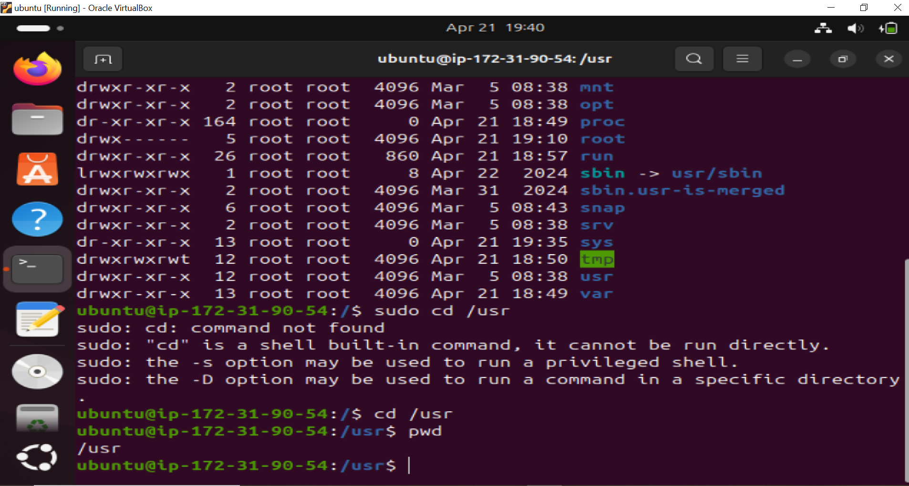
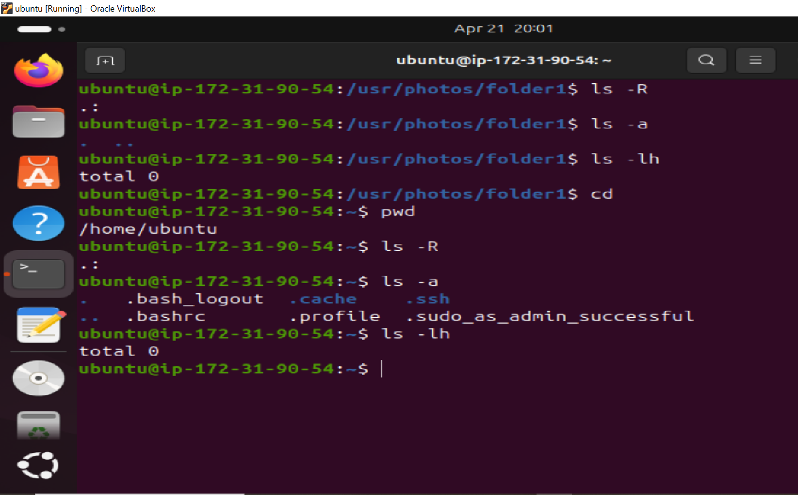

# Linux-Commands

## This project demostrates a deep dive into the use of Linux commands. Linux commands are text-based instructions used to interact with the Linux operating system through the terminal (command line interface). They allow users to perform a wide range of tasks like managing files and directories, installing software, monitoring system performance, and configuring the system.

## Basic File and Directory Commands
- `sudo` –  Executes a command with superuser (root) privileges

- `ls` – List files and directories
- `cd` – Change the current directory
- `pwd` – Display the current directory path
- `mkdir` – Create a new directory
- `rm` – Remove files or directories
- `cp` – Copy files or directories
- `mv` – Move or rename files or directories

- `nano` – Opens a simple terminal-based text editor to edit files.

- `cat` – Displays the contents of a file on the terminal.

- `touch` – Creates an empty file or updates the timestamp of an existing file.

- `find` – Searches for files and directories in a specified path based on name, type, size, modification time, and other criteria.

## LINUX SERVER DASHBOARD SCREENSHOT: This is a screenshot of AWS EC2 Dashboard for our Linux-Server

## SUMMARY OF EC2 DASHBOARD

## CONNECTING TO LINUX SERVER USING SSH

## MANIPULATING FILES AND DIRECTORIES ON LINUX COMMANDS.

## SUDO COMMAND

### The sudo (SuperUser DO) command in Linux allows regular users to perform tasks that require administrative (root) privileges. It is commonly used to install software, change system configurations, manage user accounts, and access restricted files. By using sudo, users can perform critical tasks without logging in as the root user, enhancing both security and accountability. Every use of sudo is typically logged, making it easier to track changes made to the system.

## Sometimes when creating a folder in a restricted location such as the /root directory, which is research for the root user. You will like encounter a permission denied error like the one on the screenshot below.

## This error occur because regular users do not have the necessary permission to create directories in /root. Sudo is successfully use to create the folder

## PWD COMMAND

## The pwd (Print Working Directory) command in Linux is used to display the full path of the current directory you are in. It helps users know their exact location in the file system hierarchy, which is especially useful when navigating through multiple directories via the terminal.

## LINUX DIRECTORY STRUCTURE

## The Linux directory structure is hierarchical, starting from the root directory /. Every file and directory stems from this root. It organizes system files, user files, libraries, device files, and more into standard locations to maintain consistency across distributions.

## SIDE HUSTLE TASK 1

- Creating a directory call "photo" direcory. 

- Create 3 more random directories inside  the photo directory 

- Show the newly created directories on the terminal, then navigating into one of them 

- Finally display show full path where you currently are on the screen 

## ls COMMAND

## The ls (list) command in Linux is used to display the contents of a directory. It shows files and subdirectories in the current or specified path. It’s one of the most commonly used commands for navigating and inspecting the filesystem.

## cat COMMAND

## The cat (concatenate) command in Linux is used to display the contents of files, combine multiple files, or create new ones. It's commonly used to quickly view or read the contents of a text file directly from the terminal.

## cp COMMAND

## The cp (copy) command in Linux is used to copy files or directories from one location to another. It is commonly used for backing up files, duplicating content, or transferring data within the file system.

## COPYING MULTIPLE FILES

## COPYING THE ENTIRE DIRECTORY

## mv COMMAND

## The mv (move) command in Linux is used to move or rename files and directories. It can transfer files from one location to another or change the file name in the same directory.

## rm COMMAND

## The rm (remove) command in Linux is used to delete files and directories from the file system. Once removed with rm, files are not sent to a recycle bin—they are permanently deleted (unless backed up).

## touch COMMAND

The touch command in Linux is used to create empty files or update the timestamp of existing files. It’s a quick way to make new text files or refresh file modification times.

